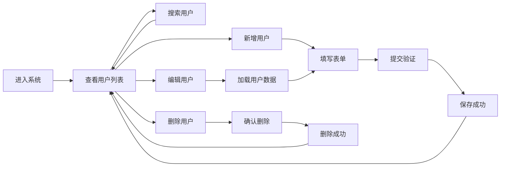

## 1. 产品概述

用户管理系统是一个基于 Web 的全栈应用，用于管理用户信息的增删改查操作。系统面向管理员用户，提供简洁直观的用户信息管理界面，解决传统用户数据管理效率低下的问题。

- 核心目标：提供高效、易用的用户信息管理功能
- 目标用户：系统管理员、运营人员
- 产品价值：提升用户数据管理效率，降低操作成本

## 2. 核心功能

### 2.1 用户角色

| 角色 | 注册方式 | 核心权限 |
|------|----------|----------|
| 管理员 | 系统预置 | 用户增删改查、搜索过滤 |

### 2.2 功能模块

1. **用户列表页**：用户数据表格展示、分页、搜索框、操作按钮
2. **新增/编辑用户**：用户表单弹窗（姓名、邮箱、手机号、状态）
3. **删除确认**：删除操作二次确认弹窗

### 2.3 页面详情

| 页面名称 | 模块名称 | 功能描述 |
|----------|----------|----------|
| 用户列表页 | 搜索模块 | 支持按姓名、邮箱模糊搜索，实时过滤用户列表 |
| 用户列表页 | 用户表格 | 展示用户 ID、姓名、邮箱、手机号、状态、创建时间、操作列 |
| 用户列表页 | 操作列 | 包含编辑、删除按钮 |
| 用户列表页 | 新增按钮 | 顶部新增按钮，打开新增用户表单 |
| 表单弹窗 | 用户表单 | 包含姓名、邮箱、手机号、状态字段及校验 |
| 删除弹窗 | 确认模块 | 二次确认删除操作，防止误删 |

## 3. 核心流程

### 3.1 用户管理主流程

## 4. 用户界面设计

### 4.1 设计风格

- **主色调**：深蓝色 #1e40af（专业、稳重）
- **辅助色**：绿色 #16a34a（成功）、红色 #dc2626（警告/删除）、灰色 #6b7280（次要信息）
- **按钮风格**：圆角 6px，悬停微缩放动效
- **字体**：标题使用 'Inter'，正文使用系统无衬线字体
- **布局风格**：卡片式布局，顶部导航 + 主内容区
- **图标风格**：使用 Lucide React 线性图标

### 4.2 页面设计概述

| 页面名称 | 模块名称 | UI 元素 |
|----------|----------|---------|
| 用户列表页 | 顶部标题区 | 系统标题、描述文字、新增按钮（右对齐） |
| 用户列表页 | 搜索区 | 搜索输入框（带搜索图标）、重置按钮 |
| 用户列表页 | 表格区 | 斑马纹表格、行悬停高亮、操作按钮组 |
| 用户列表页 | 空状态 | 无数据时显示友好提示和新增引导 |
| 表单弹窗 | 弹窗容器 | 半透明遮罩、居中弹窗、平滑进入动画 |
| 表单弹窗 | 表单字段 | 标签、输入框、错误提示、必填标记 |
| 表单弹窗 | 底部操作区 | 取消按钮、确认按钮（右对齐） |
| 删除弹窗 | 确认区 | 警告图标、确认文案、取消/删除按钮 |

### 4.3 响应式

- 桌面端优先设计（≥1280px）
- 平板端（768px-1279px）：表格横向滚动，按钮尺寸适中
- 移动端（<768px）：表格转卡片列表，操作按钮垂直排列

### 4.4 交互细节

- 页面加载：表格骨架屏占位
- 搜索输入：防抖 300ms，实时过滤
- 按钮悬停：背景色加深 + 轻微上浮
- 操作反馈：成功/失败 Toast 提示
- 弹窗动画：从顶部滑入 + 淡入效果
