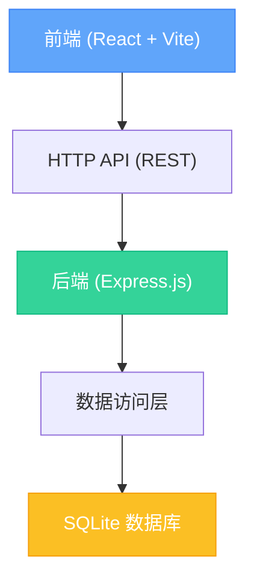
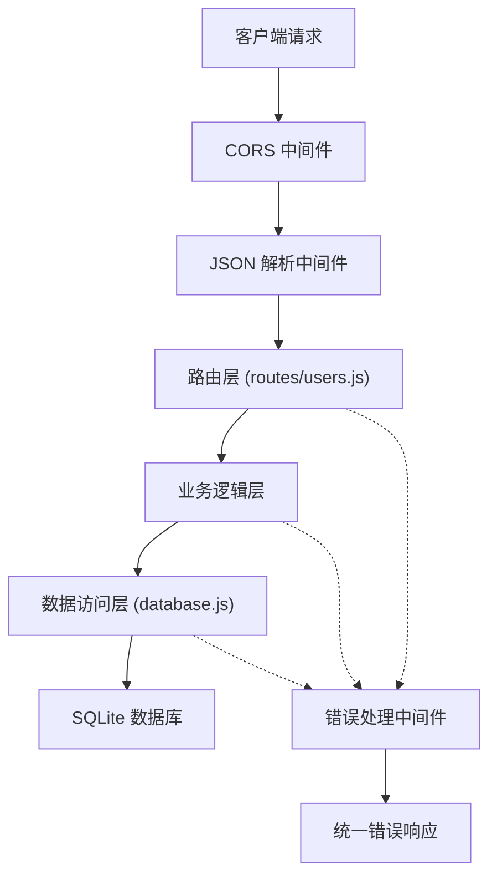
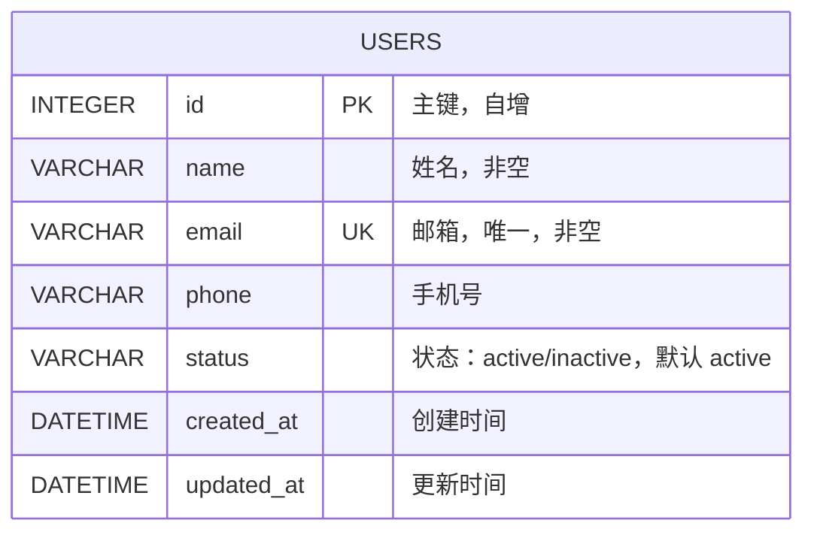

## 1. 架构设计



## 2. 技术描述

### 2.1 技术栈

| 层级 | 技术选型 | 版本 | 说明 |
|------|----------|------|------|
| 前端 | React | ^18.2.0 | UI 框架 |
| 前端 | Vite | ^5.0.0 | 构建工具 |
| 前端 | Tailwind CSS | ^3.4.0 | CSS 框架 |
| 前端 | Lucide React | ^0.344.0 | 图标库 |
| 后端 | Express.js | ^4.18.0 | Web 框架 |
| 后端 | better-sqlite3 | ^11.0.0 | SQLite 驱动 |
| 后端 | cors | ^2.8.5 | 跨域中间件 |
| 数据库 | SQLite | 3.x | 嵌入式数据库 |

### 2.2 项目结构

```
label-651/
├── backend/                    # 后端服务
│   ├── package.json
│   ├── server.js               # 入口文件
│   ├── database.js             # 数据库初始化
│   ├── routes/
│   │   └── users.js            # 用户 API 路由
│   ├── middleware/
│   │   └── errorHandler.js     # 错误处理中间件
│   └── data/
│       └── users.db            # SQLite 数据库文件
├── frontend/                   # 前端应用
│   ├── package.json
│   ├── vite.config.js
│   ├── index.html
│   └── src/
│       ├── main.jsx
│       ├── App.jsx
│       ├── components/
│       │   ├── UserList.jsx    # 用户列表组件
│       │   ├── UserForm.jsx    # 用户表单组件
│       │   ├── SearchBar.jsx   # 搜索栏组件
│       │   └── ConfirmModal.jsx # 确认弹窗组件
│       ├── services/
│       │   └── api.js          # API 服务
│       └── index.css
└── .trae/
    └── documents/
        ├── prd.md
        └── tech-arch.md
```

## 3. 路由定义

### 3.1 前端路由

| 路由 | 页面/组件 | 说明 |
|------|----------|------|
| / | UserList | 用户列表首页（单页应用，无路由切换） |

### 3.2 后端 API 路由

| 方法 | 路由 | 说明 |
|------|------|------|
| GET | /api/users | 获取用户列表（支持搜索参数） |
| GET | /api/users/:id | 获取单个用户详情 |
| POST | /api/users | 创建新用户 |
| PUT | /api/users/:id | 更新用户信息 |
| DELETE | /api/users/:id | 删除用户 |

## 4. API 定义

### 4.1 数据类型定义

```typescript
interface User {
  id: number;
  name: string;
  email: string;
  phone: string;
  status: 'active' | 'inactive';
  created_at: string;
  updated_at: string;
}

interface ApiResponse<T> {
  success: boolean;
  data?: T;
  message?: string;
}

interface UserListResponse extends ApiResponse<User[]> {
  data: User[];
  total: number;
}
```

### 4.2 请求/响应示例

#### GET /api/users?search=张三

**响应：**
```json
{
  "success": true,
  "data": [
    {
      "id": 1,
      "name": "张三",
      "email": "zhangsan@example.com",
      "phone": "13800138001",
      "status": "active",
      "created_at": "2024-01-15T10:30:00Z",
      "updated_at": "2024-01-15T10:30:00Z"
    }
  ],
  "total": 1
}
```

#### POST /api/users

**请求体：**
```json
{
  "name": "李四",
  "email": "lisi@example.com",
  "phone": "13800138002",
  "status": "active"
}
```

**响应：**
```json
{
  "success": true,
  "data": {
    "id": 2,
    "name": "李四",
    "email": "lisi@example.com",
    "phone": "13800138002",
    "status": "active",
    "created_at": "2024-01-16T08:00:00Z",
    "updated_at": "2024-01-16T08:00:00Z"
  },
  "message": "用户创建成功"
}
```

#### PUT /api/users/:id

**请求体：**
```json
{
  "name": "李四（更新）",
  "email": "lisi_new@example.com",
  "phone": "13900139002",
  "status": "inactive"
}
```

#### DELETE /api/users/:id

**响应：**
```json
{
  "success": true,
  "message": "用户删除成功"
}
```

## 5. 服务端架构图



## 6. 数据模型

### 6.1 数据模型定义



### 6.2 DDL 语句

```sql
CREATE TABLE IF NOT EXISTS users (
  id INTEGER PRIMARY KEY AUTOINCREMENT,
  name VARCHAR(100) NOT NULL,
  email VARCHAR(255) NOT NULL UNIQUE,
  phone VARCHAR(20),
  status VARCHAR(20) NOT NULL DEFAULT 'active',
  created_at DATETIME DEFAULT CURRENT_TIMESTAMP,
  updated_at DATETIME DEFAULT CURRENT_TIMESTAMP
);

CREATE INDEX IF NOT EXISTS idx_users_name ON users(name);
CREATE INDEX IF NOT EXISTS idx_users_email ON users(email);
CREATE INDEX IF NOT EXISTS idx_users_status ON users(status);

-- 初始化测试数据
INSERT INTO users (name, email, phone, status) VALUES
('张三', 'zhangsan@example.com', '13800138001', 'active'),
('李四', 'lisi@example.com', '13800138002', 'active'),
('王五', 'wangwu@example.com', '13800138003', 'inactive'),
('赵六', 'zhaoliu@example.com', '13800138004', 'active'),
('钱七', 'qianqi@example.com', '13800138005', 'active');
```

## 7. 开发规范

### 7.1 代码规范

- 前端：使用 ES6+ 语法，函数式组件 + Hooks
- 后端：使用 CommonJS 模块，遵循 Express 最佳实践
- 代码风格：2 空格缩进，语义化命名

### 7.2 错误处理

- 后端统一错误格式：`{ success: false, message: '错误信息' }`
- HTTP 状态码：200（成功）、400（参数错误）、404（资源不存在）、500（服务器错误）

### 7.3 启动命令

```bash
# 后端启动 (端口 3001)
cd backend && npm install && npm start

# 前端启动 (端口 5173)
cd frontend && npm install && npm run dev
```
